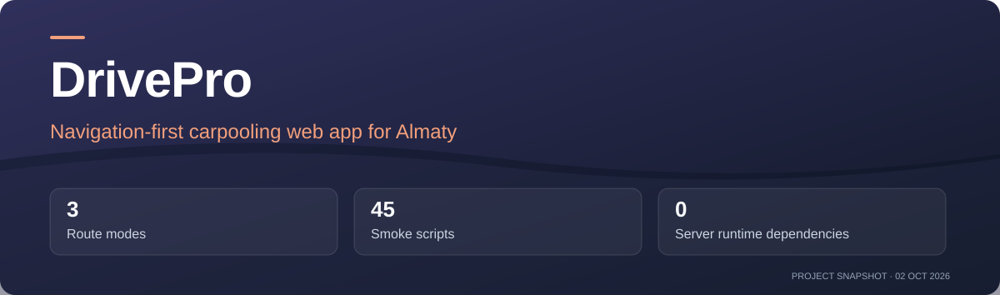

<!-- project-presentation:start -->



**[Open project](https://drivepro-almaty.duckdns.org/)** · [Repository activity](https://github.com/igor-vuta/DrivePro_2/activity)

[](https://github.com/igor-vuta/DrivePro_2/commits)
[](https://github.com/igor-vuta/DrivePro_2)

**3** Route modes · **45** Smoke scripts · **0** Server runtime dependencies

*Project facts checked 2 October 2026. Activity badges update from GitHub.*

<!-- project-presentation:end -->

<!-- project-pattern:start -->



<!-- project-pattern:end -->

# DrivePro

DrivePro is a navigation-first carpooling PWA, initially focused on Almaty.
Plan a walking, cycling or driving route, then optionally share a lift along the
way. Matching is based on the driver's route; both people confirm before precise
location and contact details are exchanged. There are no fares.

[Open the current web deployment](https://drivepro-almaty.duckdns.org/). The public
page and health endpoint were reachable during this documentation review; the
production OTP, provider delivery and rider/driver pilot gates in `TRACK.md`
remain to be verified.

Current requirements and release evidence live in [PROJECT.md](PROJECT.md) and
[TRACK.md](TRACK.md). [ROADMAP.md](ROADMAP.md) preserves earlier feature decisions;
[DESIGN.md](DESIGN.md) describes the current interface.

## Project layout

- `server/`: REST API and websocket hub, with no runtime npm dependencies.
- `app/`: Expo SDK 54 / React Native app and the committed web build in `app/dist`.
- Root tooling: commit-message validation and the full smoke-test entry point.

## Local development

Use Node 24.19.0 from `.nvmrc` for checks and web builds. With fnm installed:

```bash
fnm use
npm ci --ignore-scripts
cd app
npm ci
```

Start the server in one terminal and Expo in another:

```bash
# From the repository root; development data is stored under server/data.
NODE_ENV=development node server/src/index.js
```

```bash
cd app
npm start
```

Press `w` for web, or use a compatible Expo Go client on the same Wi-Fi. Configure
`MANUAL_SERVER` in `app/src/config.js` only when using a different server origin.
Native device and store releases need separate validation; this milestone targets
web browsers.

Local phone verification uses mock codes when delivery providers are absent.
With `NODE_ENV=production`, verification codes are never returned to clients,
even when an old `OTP_ECHO=1` override remains. Missing SMS configuration fails
delivery; a connected Telegram bot can still offer its signup verification flow.
Controlled real delivery and complete user journeys remain pilot gates. See
`deploy/DEPLOY.md` and `TRACK.md` before inviting testers.

## Checks and releases

```bash
npm run check
cd app
npx expo export --platform web
node tools/postexport.mjs
```

If the shell exports `NO_COLOR`, unset it for the Expo export; Metro sets
`FORCE_COLOR` for its workers and Node reports the conflicting flags. Commit the
rebuilt `app/dist` with its source changes. The backend serves it from port 4000.

Commits use the existing `L<number> short subject` format and a meaningful body.
Validate every outgoing message with `npm run commitlint -- --from <base> --to HEAD`,
SSH-sign it with the owner's existing identity, and verify its signature. A local
commit hook is available with `git config core.hooksPath .githooks` after installing
root tooling. Do not add co-author, contributor or session trailers.

The existing main-branch workflow checks commit messages, runs the complete smoke
suite, then updates the configured deployment. Batch validated changes into one
push; verify that exact revision's CI and the served build separately. New hosting,
social publication and invitations require the owner's approval.

## The map

Out of the box the app needs no keys and no account: the basemap is
OpenStreetMap's own raster tiles through Leaflet, which work in every country.
At night there is no dark OpenStreetMap raster to switch to, so the tiles are
inverted in CSS (`colors.mapFilter` in `app/src/theme.js`) rather than glaring
white inside a dark app.

2GIS is better than that — but only where 2GIS has data. Configuring the
variables below turns its MapGL vector basemap on **inside the countries 2GIS
maps** (the `COVERED` boxes in `app/src/mapconfig.js`, Kazakhstan first);
everywhere else stays on OpenStreetMap, automatically. The server prints which
basemap is live on startup.

| Variable | Needed for |
|---|---|
| `TWOGIS_MAP_KEY` | The MapGL basemap key. Without it, 2GIS never draws anywhere. MapGL authenticates from the browser, so this key reaches every client — make it a **second key, domain-restricted** in the 2GIS console, not the catalog key. |
| `TWOGIS_MAP_STYLE_DARK` | A dark style id authored at <https://styles.2gis.com>. 2GIS publishes no dark style anyone can reference, and this app is dark by default — **without this the night map stays on OpenStreetMap raster even inside Kazakhstan**, which looks like the key did nothing. |
| `TWOGIS_MAP_STYLE` | The light style id. Optional; MapGL's built-in style is already light. |
| `TWOGIS_KEY` | The **catalog** key, a separate concern: POI search and address lookup (`/api/places/*`). It stays on the server and is never sent to a browser. Setting only this one makes the server reuse it as a map key and warn at boot — that fallback keeps a one-key deployment working, it is not the intended setup. |

All four are read in `server/src/places.js`. In production they live in
`/etc/drivepro.env`; see `deploy/DEPLOY.md`.

## Technical notes

- The server persists to `server/data/` (SQLite when available, JSON otherwise).
  Delete that folder for a clean slate.
- Auth uses scrypt password hashing and signed JWT-style tokens (30-day expiry).
- Realtime is a hand-rolled RFC 6455 websocket endpoint at `/ws` — no Socket.IO,
  so the mobile side uses the built-in `WebSocket` and the server stays
  dependency-free.
- Maps use OpenStreetMap raster tiles with Nominatim geocoding and OSRM routing —
  no API keys required. 2GIS is optional on top; see "The map" above.
